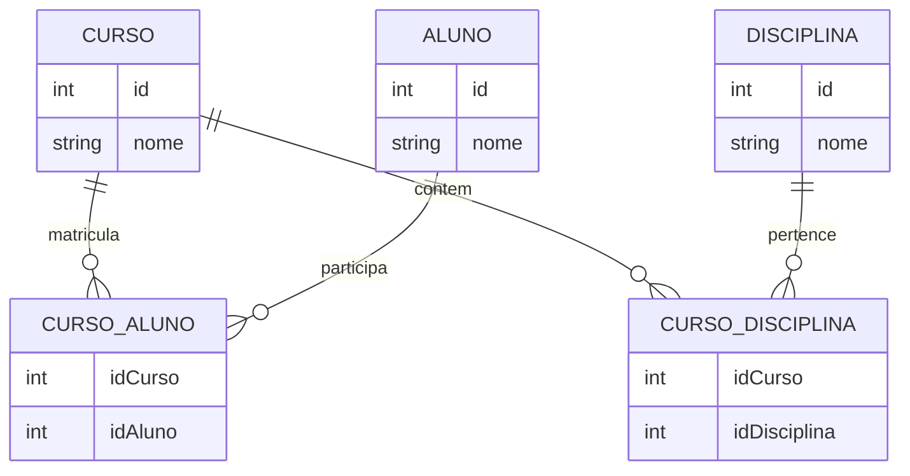

- Diagrama dos relacionamentos

```mermaid
erDiagram
    CURSO ||--o{ CURSO_ALUNO : matricula
    ALUNO ||--o{ CURSO_ALUNO : participa

    CURSO ||--o{ CURSO_DISCIPLINA : contem
    DISCIPLINA ||--o{ CURSO_DISCIPLINA : pertence

    CURSO {
        int id
        string nome
    }

    ALUNO {
        int id
        string nome
    }

    DISCIPLINA {
        int id
        string nome
    }

    CURSO_ALUNO {
        int idCurso
        int idAluno
    }

    CURSO_DISCIPLINA {
        int idCurso
        int idDisciplina
    }
```
